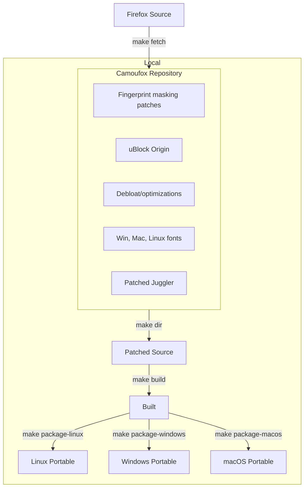
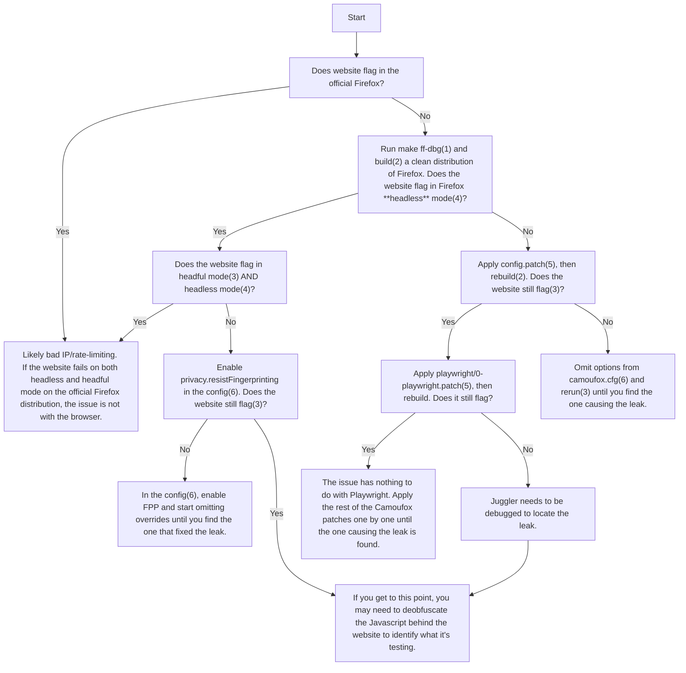

# camoufox-beta

A fork of [Camoufox](https://github.com/daijro/camoufox), the Firefox build for web scraping and browser automation that spoofs device fingerprints in C++ rather than with injected JavaScript. Each launch gets an identity drawn from the real-world distribution of devices ([fpgen](https://github.com/scrapfly/fingerprint-generator)), checked for internal consistency, and driven through a patched Playwright protocol that pages cannot see.

This fork follows upstream `main` (merged 2026-09-28, e92caec) and releases its own builds as `v152.0.4-beta.31-cg.N`. The differences are listed below. Fixes made here are offered upstream: seven landed in daijro/camoufox#803.

> [!NOTE]
> Under development. Test a release against your own targets before relying on it.

---

## How this fork differs

### From [daijro/camoufox](https://github.com/daijro/camoufox) `main`

**Build and releases**
- Linux x86_64 only, built by this repository's CI and published as GitHub releases with sha256 digests. No PyPI or npm packages are published from here.
- Cross-language LTO and profile-guided optimization with a pinned profile (release `pgo-152.0.4-r2`), and Rust SIMD, as stock Firefox builds. The font bundle is hosted in this repository's releases.

**Browser**
- **Config and getter cost.** Config lookups go through a precomputed index, and per-context getters are memoized without a synchronous round trip to the parent on first read (`additions/camoucfg/MaskConfig.hpp`, `patches/anti-font-fingerprinting.patch`). Spoofed getters do the same work stock ones do before returning, so their timing matches stock Firefox (`patches/zz-stock-cost-parity.patch`).
- **Fonts.** Per-script fallback fonts follow the claimed OS on Linux builds, and each identity gets its OS's stock font prefs.
- **Windows identity on a Linux host.** Media `decodingInfo` and hardware codecs, WebGPU with Windows limits, and DirectWrite line metrics answer as Windows does (`media:hwCodecs`, `webGpu:limits`, `fonts:metrics`).
- **Storage.** Storage writes from worker threads are dispatched to the main thread. Upstream left this out; there is a known gap for a worker that starts before its process's main thread has used the storage.
- **Input.**
  - Juggler's input waits are bounded, and the first cursor move of a page enters from the top edge instead of (0, 0).
  - Wheel deltas stay correct at display scales other than 1.
  - Humanized moves are paced on their own schedule, so acks do not stretch them.
  - `humanize_engine="mousecrack"` adds a second cursor generator (see [Page Interactions](#page-interactions)).
- **uBlock Origin** does not hold page loads while it compiles its lists (`suspendUntilListsAreLoaded=false`); requests in the first seconds of a launch are not filtered.

**Python launcher**
- Scrollbars are drawn as the claimed OS draws them, even on a host running a different OS.
- The identity's devicePixelRatio is rendered (`layout.css.devPixelsPerPx`), not just reported.
- Web Audio is not noised by default, so every context renders stock Firefox's value.
- Xvfb gets 30 s to start instead of 10.
- WebGL comes from fpgen's recorded devices, with `webgl_data.db` as a fallback for GPUs fpgen lacks (`pythonlib/camoufox/webgl_db.py`).
- `block_webrtc`, `block_images` and `disable_coop` write their prefs on every launch, on or off, so a persistent profile does not keep a setting after the flag is removed.
- The TypeScript launcher is in the tree as upstream has it, but its CI jobs do not gate this fork's builds, and this fork's launcher changes are not ported to it.

### From [JWriter20/camoufox](https://github.com/JWriter20/camoufox)

JWriter20 maintains upstream, and his fork's `main` matches daijro's (checked 2026-09-28), so the list above applies to it too. His unmerged work lives on branches. The one that changes the most is `autoupdate/firefox-156.0.1`: it moves to Firefox 156.0.1 (release beta.32), while upstream `main` and this fork are on Firefox 152.0.4 (beta.31).

---

## Installing

Each release carries a Linux x86_64 browser zip and its sha256 in [Releases](https://github.com/coffeegrind123/camoufox-beta/releases). Install the launcher from the commit the release tag points at, so the two agree about the config properties:

```bash
pip install "camoufox[geoip] @ git+https://github.com/coffeegrind123/camoufox-beta.git@<release commit>#subdirectory=pythonlib"
```

Every commit reports the same package version, so pass `--force-reinstall` when moving between commits. Then unpack the browser zip, check its sha256 against the release's `digest`, and point the launcher at it:

```python
from camoufox.sync_api import Camoufox

with Camoufox(executable_path="/opt/camoufox/camoufox-bin") as browser:
    ...
```

The launcher installs fpgen's model itself: pinned by URL and sha256 and verified, with no network access from fpgen. To install it ahead of time, for example while building an image as the owner of fpgen's package directory:

```bash
python -c "from camoufox.fpgen_model import ensure_fpgen_model; ensure_fpgen_model()"
```

`camoufox fetch` downloads browsers from the repositories in `pythonlib/camoufox/repos.yml` (upstream's), not from this fork's releases.

---

## Fingerprint Injection

In Camoufox, data is intercepted at the C++ implementation level, so the changes are not visible to JavaScript inspection.

To spoof individual fingerprint properties, pass them to the [Python launcher](pythonlib/):

```py
>>> with Camoufox(config={"property": "value"}) as browser:
```

Config data not set by the user is populated from [fpgen](https://github.com/scrapfly/fingerprint-generator), a model of the statistical distribution of device characteristics in real-world traffic. The assembled identity is then checked for coherence, so parts that are each plausible cannot combine into a machine that does not exist.

[[See implemented properties](https://camoufox.com/fingerprint/)]

---

## Usage

Camoufox is compatible with your existing Playwright code. You only have to change your browser initialization.

**Python, sync API**

```python
from camoufox.sync_api import Camoufox

with Camoufox() as browser:
    page = browser.new_page()
    page.goto("https://example.com")
```

**Python, async API**

```python
from camoufox.async_api import AsyncCamoufox

async with AsyncCamoufox() as browser:
    page = await browser.new_page()
    await page.goto("https://example.com")
```

Upstream's launcher documentation (options, virtual display, remote server) applies to this fork: [camoufox.com/python](https://camoufox.com/python/).

---

## Capabilities

Below is a list of patches and features implemented in Camoufox.

### Fingerprint spoofing

- Navigator properties spoofing (device, browser, locale, etc.)
- Support for emulating screen size, resolution, etc.
- Spoof WebGL parameters, supported extensions, context attributes, and shader precision formats.
- Spoof inner and outer window viewport sizes
- Spoof AudioContext sample rate, output latency, and max channel count
- Spoof device voices & playback rates
- Spoof the amount of microphones, webcams, and speakers available.
- Network headers (Accept-Languages and User-Agent) are spoofed to match the navigator properties
- WebRTC IP spoofing at the protocol level
- Geolocation, timezone, and locale spoofing
- etc.

### Stealth patches

- Avoids main world execution leaks. All page agent javascript is sandboxed
- Avoids frame execution context leaks
- Fixes `navigator.webdriver` detection
- Fixes Firefox headless detection via pointer type ([#26](https://github.com/daijro/camoufox/issues/26))
- Removed potentially leaking anti-zoom/meta viewport handling patches
- Uses non-default screen & window sizes
- Re-enable fission content isolations
- Re-enable PDF.js
- Other leaking config properties changed
- Human-like cursor movement (`humanize=True`), from recorded human movements (Cursory, default) or a trained network (mousecrack)

### Anti font fingerprinting

- Automatically uses the correct system fonts for your User Agent
- Bundled with Windows, Mac, and Linux system fonts
- No glyph-spacing noise: measured text widths are the ones the same font gives on a real machine

### Playwright support

- Playwright's Firefox protocol (Juggler), patched for Firefox 152
- Various config patches to evade bot detection

### Debloat/Optimizations

- Many Mozilla services removed or disabled
- Patches from LibreWolf & Ghostery to help remove telemetry & bloat
- Debloat config from PeskyFox, LibreWolf, and others
- Speed & network optimizations from FastFox
- Animations run on stock timing; `instantAnimations: True` finishes them at once, at the cost of being detectable
- Minimalistic theming
- etc.

### Addons

- Load Firefox addons without a debug server by passing a list of paths to the `addons` property
- Added uBlock Origin with custom privacy filters
- Addons are not allowed to open tabs
- Addons are automatically enabled in Private Browsing mode
- Addons are automatically pinned to the toolbar
- Fixes DNS leaks with uBO prefetching
- uBO does not hold page loads while it compiles its filter lists, which it does on every launch (each launch is a fresh profile); requests in the first seconds after launch are not filtered

### Python launcher

- Automatically generates & injects unique device characteristics into Camoufox based on their real-world distribution
- WebGL fingerprint injection & rotation
- Uses the correct system fonts and subpixel antialiasing & hinting based on your target OS
- Avoid proxy detection by calculating your target geolocation, timezone, & locale from your proxy's target region
- Calculate and spoof the browser's language based on the distribution of language speakers in the proxy's target region
- Remote server hosting to use Camoufox with other languages that support Playwright
- Built-in virtual display buffer to run Camoufox headfully on a headless server
- Toggle image loading, WebRTC, and WebGL
- etc.

> [!NOTE]
> Camoufox does **not** fully support injecting Chromium fingerprints. Some WAFs (such as [Interstitial](https://nopecha.com/demo/cloudflare)) test for Spidermonkey engine behavior, which is impossible to spoof.

---

# Stealth Overview

## How Camoufox hides its automation library

In Camoufox, all of Playwright's internal Page Agent's code is sandboxed and isolated. This makes it impossible for a page to detect the presence of Playwright through Javascript inspection.

Normally, Playwright injects some JavaScript into the page such as `window.__playwright__binding__` and to perform actions like querying elements, evaluating javascript, or running init scripts, which can be detected by websites. In Camoufox, these actions are handled in an isolated scope outside of the page. In other words, websites can no longer "see" any JavaScript that Playwright would typically inject. This prevents traces of Playwright altogether.

However, even with hiding its automation library, Camoufox is not immune to inconsistencies in fingerprint rotation. This still requires maintenance to spot and fix.

### Page Interactions

Anti-bot systems also run client-side scripts to monitor your behavior. For example, they look for patterns in mouse movements, clicks, scrolling, and the timing between actions.


Every dot above is a `mousemove` event the page received from six `page.mouse.move()` calls, replayed at the speed it arrived. Close dots mean the hand slowed down. `scripts/cursor-demo.py` regenerates the figure from a build.

Camoufox does not draw its cursor paths with an equation. `humanize=True` has two generators, chosen with `humanize_engine`:

- **Cursory** (default). [Cursory](https://github.com/Vinyzu/cursory) by [Vinyzu](https://github.com/Vinyzu) holds 2357 mouse movements recorded from real people. It picks a recording whose direction, distance and wander suit the move being made, morphs it onto the requested start and end points, and replays it with that recording's own timing — pauses, overshoots and all. Camoufox ships [cursory-js](https://github.com/JWriter20/cursory-js), a TypeScript port of it, vendored into Juggler at `additions/juggler/input/cursory/`. **Cursory is LGPLv3-or-later, not MPL-2.0 like the rest of the browser**; its licence and provenance are in `additions/juggler/input/cursory/NOTICE`.
- **mousecrack** (`humanize_engine="mousecrack"`). [mousecrack](https://github.com/puffinsoft/mousecrack) by puffinsoft is a recurrent network trained on recorded movements. It synthesizes each path step by step instead of replaying one. Camoufox runs the network in plain JavaScript inside Juggler (`additions/juggler/input/mousecrack/`, MIT). Its short moves match human timing; its medium and long moves are slower and wander more than a hand's (measurements in that directory's README). That is why Cursory stays the default.

Both are paced on their own schedule, so the page receives the uneven gaps the generator produced. Camoufox previously walked a Bézier curve through two random knots and emitted a point every 10ms. An analytic curve sampled at a fixed rate has velocity and jerk profiles that separate cleanly from a hand's, and every movement sped up and slowed down the same way.

Neither is perfect: sophisticated enough analysis may still tell them apart from a hand.

---

## How Camoufox rotates identities

AI agents need to operate across many sessions without getting flagged or rate-limited. Rotating your IP address isn't enough — every browser session carries thousands of signals that create a unique **fingerprint**. A website can see your OS, GPU, screen resolution, fonts, timezone, and more. If those signals are inconsistent or unusual, you get blocked.

### Market Share Distribution

Even if you are rotating your IP for each running bot instance, web access firewalls can still use machine learning to analyze incoming web traffic to detect if it's abnormal. If the Linux market share was 5%, then suddenly it's 20%, it's a red flag. They will unconditionally require all Linux users to complete a captcha.

Camoufox draws identities from [fpgen](https://github.com/scrapfly/fingerprint-generator), a Bayesian network trained on live traffic, so each device characteristic appears about as often as it does in the real world, and in the combinations real devices produce.

### How can Camoufox be detected?

Camoufox can spoof fingerprints with a correct market share. However, **fingerprints must also be internally consistent.** A Windows user agent with an Apple M1 GPU, a MacOS user agent with a Windows DirectX renderer, and a mobile device with a desktop screen resolution are all impossible, and will be flagged for being suspicious.

Every drawn identity passes a coherence check (`pythonlib/camoufox/coherence.py`) that rejects impossible combinations before launch. But of the thousands of datapoints that must agree with each other, Camoufox doesn't always get every one right. Anti-bot providers test Camoufox over and over again to find even 1 unique inconsistency, then they immediately update their background scripts to test for it.

---

## How does Camoufox compare to other solutions?

### JavaScript-based solutions

In the past, developers tried injecting JavaScript to spoof these values, but it doesn't work reliably since JavaScript can't spoof everything. Incomplete coverage causes inconsistent fingerprints. For example, an anti-bot system will flag you if your network request's User Agent doesn't match your navigator's User Agent.

Additionally, all injected JavaScript is detectable in some way. Anti-bot systems can check if `Object.getOwnPropertyDescriptor` reveals an overwritten property, if a function's `toString()` no longer returns `[native code]` (revealing it was hijacked), or if data in the window context doesn't match the worker thread context. Workarounds only take you so far, but there will always be a way to detect JS injection if you search deep enough.

#### Camoufox's approach

Since Camoufox intercepts calls in the browser's C++ implementation level, all of the hijacked objects and properties appear native. There is no JavaScript hijacking to be detected.

Camoufox also generates consistent and believable fingerprints with fpgen and its coherence check. However, this can still be detected by complex fingerprint detection methods like mismatching data (as described earlier).

<hr width=50>

### CDP-based libraries

CDP (Chrome DevTools Protocol) is an automation protocol built into Chromium and Firefox. However, CDP makes no effort to hide the fact that it's an automation protocol and exposes much of its functionality in the page scope. Some common methods are checking if `navigator.webdriver` is true, catching it reading the stack debugger, checking for variables that ChromeDriver injects into the document object for internal communication, and more.

#### Camoufox's approach

While Playwright uses CDP to control Chromium, it uses _Juggler_ for Firefox. Juggler is a custom protocol developed before Firefox supported CDP ([original repo](https://github.com/puppeteer/juggler)). It is a distinct module within Firefox, and not part of its core browser. This makes it easier to edit and control what's revealed to the page.

Camoufox patches Juggler to give it its own isolated "copy" of the page to work with. Playwright can read and edit its own version of the page freely. Everything appears to work normally to it, but the real page is completely unaffected by these changes. The page also can't detect when things are being read (through tricks like hijacking getters) or listeners being added to watch elements.

Additionally, Juggler sends its inputs directly through the Firefox's original user input handlers, meaning they are handled the exact same way as if you were using the browser normally. Camoufox also patches Firefox's headless mode to appear the same as if it were running in a normal window. But as a fallback, the Python library can run Camoufox in a [virtual display](https://camoufox.com/python/virtual-display/) if headless mode ever leaks.

---

<h1 align="center">Build System</h1>

> [!WARNING]
> The content below is intended for those interested in building & debugging Camoufox. For usage instructions, see [pythonlib](pythonlib/) or [typescript](typescript/).

### Overview

Here is a diagram of the build system, and its associated make commands:



This was originally based on the LibreWolf build system.

## Build CLI

> [!WARNING]
> Camoufox's build system is designed to be used in Linux. WSL will not work!

First, clone this repository with Git:

```bash
git clone --depth 1 https://github.com/coffeegrind123/camoufox-beta
cd camoufox-beta
```

Next, build the Camoufox source code with the following command:

```bash
make dir
```

Before bootstrapping, install the system build dependencies with the helper
script. It detects your platform and installs everything the build needs
(Python ≥ 3.11, Rust, `aria2`, `p7zip`, `msitools`, `wget`, `sqlite`, and
the core build tools) using the appropriate package manager — Homebrew on macOS,
or `apt`/`dnf`/`pacman` on Linux:

```bash
bash scripts/install-deps.sh
```

> [!NOTE]
> The dependency installer has so far only been tested on macOS.

After that, you have to bootstrap your system to be able to build Camoufox. You only have to do this one time. It is done by running the following command:

```bash
make bootstrap
```

Finally you can build and package Camoufox the following command:

```bash
python3 multibuild.py --target linux windows macos --arch x86_64 arm64 i686
```

For new builds, `i686` is supported only for Windows. Unsupported target/architecture combinations are skipped. This fork's releases are built by its CI for Linux x86_64 only, with cross-language LTO and a pinned PGO profile; the other targets are upstream's and are not built or tested here.

<details>
<summary>
CLI Parameters
</summary>

```bash
Options:
  -h, --help            show this help message and exit
  --target {linux,windows,macos} [{linux,windows,macos} ...]
                        Target platforms to build
  --arch {x86_64,arm64,i686} [{x86_64,arm64,i686} ...]
                        Target architectures to build for each platform
  --bootstrap           Bootstrap the build system
  --clean               Clean the build directory before starting

Example:
$ python3 multibuild.py --target linux windows macos --arch x86_64 arm64
```

</details>

### Using Docker

Camoufox can be built through Docker on all platforms.

1. Create the Docker image containing Firefox's source code:

```bash
docker build -t camoufox-builder .
```

2. Build Camoufox patches to a target platform and architecture:

```bash
docker run -v "$(pwd)/dist:/app/dist" camoufox-builder --target <os> --arch <arch>
```

<details>
<summary>
How can I use my local ~/.mozbuild directory?
</summary>

If you want to use the host's .mozbuild directory, you can use the following command instead to run the docker:

```bash
docker run \
  -v "$HOME/.mozbuild":/root/.mozbuild:rw,z \
  -v "$(pwd)/dist:/app/dist" \
  camoufox-builder \
  --target <os> \
  --arch <arch>
```

</details>

<details>
<summary>
Docker CLI Parameters
</summary>

```bash
Options:
  -h, --help            show this help message and exit
  --target {linux,windows,macos} [{linux,windows,macos} ...]
                        Target platforms to build
  --arch {x86_64,arm64,i686} [{x86_64,arm64,i686} ...]
                        Target architectures to build for each platform
  --bootstrap           Bootstrap the build system
  --clean               Clean the build directory before starting

Example:
$ docker run -v "$(pwd)/dist:/app/dist" camoufox-builder --target windows macos linux --arch x86_64 arm64 i686
```

</details>

Build artifacts will now appear written under the `dist/` folder.

---

## Working on patches

`make dir` leaves `camoufox-<version>-<release>/` as a git repository with every patch applied. A patch is a diff against a checkpoint in that repository:

```bash
# A new patch
make dir                 # apply every existing patch
make first-checkpoint    # mark the starting point
# ...edit files in camoufox-*/, test with `make build` and `make run`...
make diff > patches/my-change.patch

# An existing patch
make dir
make workspace ./patches/x.patch   # unapply x, checkpoint, reapply x
# ...edit...
make diff > patches/x.patch
```

`make diff` shows only tracked files, so `git add -N <file>` any new file first. `make workspace` needs every later patch to leave the hunks of `x.patch` alone. `make patch` and `make unpatch` apply or reverse one patch, and `make revert` resets the tree to unpatched Firefox.

Then run the suites that cover what you changed. [`CONTRIBUTING.md`](CONTRIBUTING.md) says which ones, and [`ci/README.md`](ci/README.md) has the whole pipeline.

---

## Leak Debugging

This is a flow chart demonstrating my process for determining leaks without deobfuscating WAF Javascript. The method incrementally reintroduces Camoufox's features into Firefox's source code until the testing site flags.

This process requires a Linux system and assumes you have Firefox build tools installed (see [Build CLI](#build-cli)).

<details>
<summary>
See flow chart...
</summary>



#### Cited Commands

| #   | Command                                       | Description                                                                                                 |
| --- | --------------------------------------------- | ----------------------------------------------------------------------------------------------------------- |
| (1) | `make ff-dbg`                                 | Setup vanilla Firefox with minimal patches.                                                                 |
| (2) | `make build`                                  | Build the source code.                                                                                      |
| (3) | `make run`                                    | Runs the built browser.                                                                                     |
| (4) | `make run args="--headless https://test.com"` | Run a URL in headless mode. All redirects will be printed to the console to determine if the test passed.   |
| (5) | `make patch ./patches/<name>.patch`           | Apply one patch. `make unpatch` reverses it.                                                                |
| (6) | `make edit-cfg`                               | Edit camoufox.cfg in the default system editor.                                                             |

</details>

---

## Licensing

- **The browser** (`patches/`, `additions/`, `settings/`, and the build system) is [MPL-2.0](LICENSE), the licence of the Firefox source it modifies. Two vendored parts differ:
  - the Cursory trajectories are LGPLv3-or-later (`additions/juggler/input/cursory/NOTICE`);
  - mousecrack's model and its port are MIT (`additions/juggler/input/mousecrack/LICENSE`).
- **The launchers** are MIT: the Python package ([`pythonlib/LICENSE`](pythonlib/LICENSE)) and the TypeScript package ([`typescript/LICENSE`](typescript/LICENSE)). The TypeScript package also contains ports of fpgen, CPython's `random` and NumPy's random generators; their notices are in [`typescript/THIRD_PARTY_NOTICES.md`](typescript/THIRD_PARTY_NOTICES.md).

---

## Thanks

Debloating & references:

- [LibreWolf](https://gitlab.com/librewolf-community/browser/source): Debloat patches & build system inspiration
- [BetterFox](https://github.com/yokoffing/BetterFox): Speed and debloat preferences
- [Ghostery](https://github.com/ghostery/user-agent-desktop): Debloat reference ([disable onboarding](https://github.com/daijro/camoufox/blob/main/patches/ghostery/Disable-Onboarding-Messages.patch))

Web scraping & testing:

- [Vinyzu/cursory](https://github.com/Vinyzu/cursory): The recorded human mouse trajectories behind `humanize=True`, vendored via [cursory-js](https://github.com/JWriter20/cursory-js) (LGPLv3-or-later — see `additions/juggler/input/cursory/NOTICE`)
- [puffinsoft/mousecrack](https://github.com/puffinsoft/mousecrack): The trained movement model behind `humanize_engine="mousecrack"` (MIT)
- [riflosnake/HumanCursor](https://github.com/riflosnake/HumanCursor): The Bézier cursor algorithm Camoufox used before Cursory
- [scrapfly/fingerprint-generator](https://github.com/scrapfly/fingerprint-generator) (fpgen): The device distribution identities are drawn from
- [CreepJS](https://github.com/abrahamjuliot/creepjs), [Browserleaks](https://browserleaks.com), [BrowserScan](https://www.browserscan.net/) - Valuable leak testing sites

UI theming:

- [Jamir-boop/minimalisticfox](https://github.com/Jamir-boop/minimalisticfox): Inspired Camoufox's minimal css theming [(link)](https://github.com/daijro/camoufox/blob/main/settings/chrome.css)
